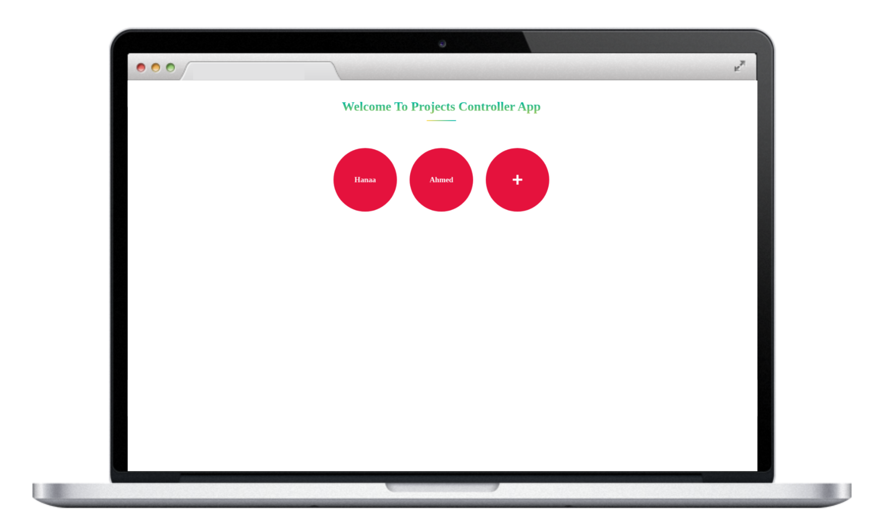
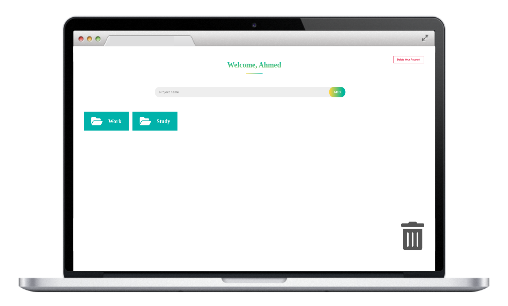
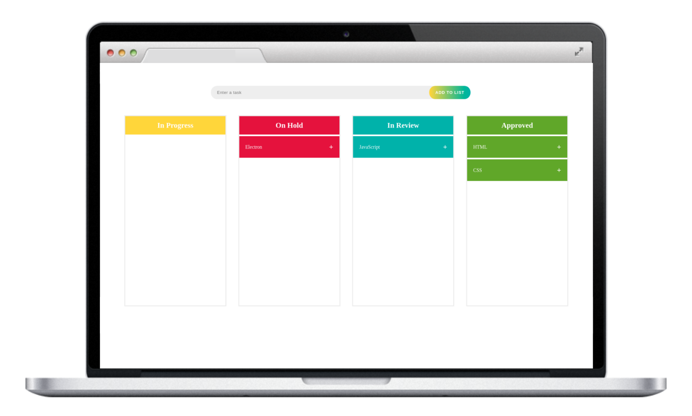

# Description

Simple yet effective `Projects Controller` Offline Desktop Application using `Electron` framework.
It help you to organize your simple, daily tasks in home, work, study ..etc

# Features

- Supports having multiple users.
- Each user can specify:
    - Multiple projects.
    - Multiple tasks for each project.
    - the status of each task.
    - Description or notes about what you should exactly do for each task.
    - you can edit your notes for each task any time.
    - you can change the task status by drag it and drop it to another section (status).
    - you can even delete the task.
    - you can delete the whole project.
    - you can delete your account.

# Tools

- `Electron` framework.
- `JsStore` library (To Execute Database operation in browsers).
- `HTML5` features
    - drag and drop.
    - sesstion storage.
    - IndexedDB.
- `CSS3` styling.
- native `JavaScript`.

# For Start

- Make sure that you have `node.js` on your machine.
- Clone or download this repository.
- Open terminal in `projects-controller` folder.
- Run `npm i`.
- Run `npm start`.

# App Screenshots

